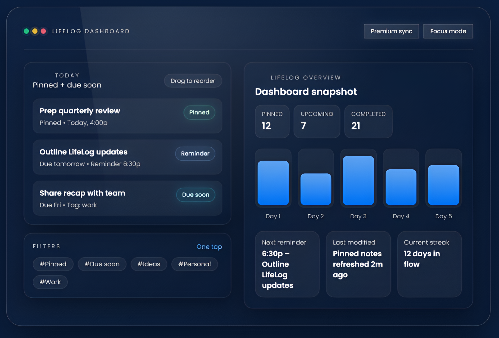

<p align="center">
  
</p>

<h1 align="center">LifeLog</h1>

<p align="center">
  <strong>A calm, focused note-taking &amp; daily planning app.</strong><br />
  Capture notes, tag them, set reminders, and stay on top of your day — all in one clean dashboard.
</p>

<p align="center">
  
  
  
</p>

---

## What is LifeLog?

LifeLog is a modern web app for people who want a **simple, distraction-free place** to organize their thoughts, tasks, and daily routines. No bloated features, no learning curve — just open it, write, and plan.

It works **offline on any device** with a browser. Free users get a full-featured local experience. Premium users unlock cloud sync, backups, and advanced workflows.

<p align="center">
  
</p>

---

## Who is it for?

- 🧠 **Daily planners** who want one calm place for notes, tasks, and reminders
- 📝 **Students** who need quick, organized note-taking with tags and search
- 💼 **Professionals** who track meeting notes, action items, and weekly reviews
- 🏃 **Routine builders** who use recurring note templates to stay consistent

---

## Features

### ✏️ Rich Text Editor
Write with headings, bold, italic, highlights, bullet lists, numbered lists, checklists, links, inline images, and text color — all with a clean toolbar. Powered by [Tiptap](https://tiptap.dev).

### 🏷️ Tags & Custom Colors
Create unlimited tags, each with its own color. See your notes grouped visually by theme at a glance.

### 📌 Pins & Due Dates
Pin your most important notes to the top. Set due dates and get **browser reminders** so nothing slips through the cracks.

### 📂 Smart Folders
Auto-filtered views that update in real time:
- Notes with a specific tag
- Pinned notes
- Due today / due this week
- Notes with any due date

### 🔍 Fast Search
Press `Ctrl+K` (or `Cmd+K`) to instantly search across all your notes. Press `Alt+N` to create a new note without touching the mouse.

### 📋 Starter Templates
One-click templates to get started fast:
- **Daily log** — Top 3 priorities, notes, and wins
- **Meeting notes** — Agenda, notes, and action items
- **Task dump** — Quick brain dump with to-do and next lists
- **Weekly review** — Wins, challenges, and next-week plan
- **Project plan** — Goals, milestones, risks, and next actions

### 🌗 Dark Mode & Focus Mode
System-aware light/dark theme. Toggle **Focus Mode** to hide all UI chrome and write distraction-free.

### 📱 Works Everywhere
LifeLog is a **Progressive Web App** (PWA) — install it on your phone, tablet, or desktop from the browser. Works offline.

---

## Free vs Premium

| | **Free** | **Premium** |
|---|---|---|
| Rich text editor | ✅ | ✅ |
| Tags + custom colors | ✅ | ✅ |
| Pins, due dates, reminders | ✅ | ✅ |
| Smart folders + search | ✅ | ✅ |
| Starter templates | ✅ | ✅ |
| Dark mode + focus mode | ✅ | ✅ |
| PWA (installable) | ✅ | ✅ |
| **Cloud sync across devices** | — | ✅ |
| **Automatic backups + version history** | — | ✅ |
| **Memory map view** (visual note map) | — | ✅ |
| **Recurring notes** (daily/weekly/monthly) | — | ✅ |
| **Export to PDF + Markdown** | — | ✅ |
| **Shareable read-only links** | — | ✅ |
| **Image uploads** (auto-optimized) | — | ✅ |
| **Note locking** (passcode protect) | — | ✅ |
| **Import local notes to cloud** | — | ✅ |
| **Price** | **$0 forever** | **$7.99/mo** or **~$79.55/yr** |

---

## How It Works

```
1. Capture     →  Write notes, tasks, or ideas in seconds
2. Organize    →  Tag, pin, color-code, and sort into smart folders
3. Act         →  Set due dates and reminders so nothing gets missed
```

That's it. No onboarding flow, no complicated setup. Sign up and start writing — or skip sign-up entirely and use it locally.

---

## Built With

| | |
|---|---|
| **Frontend** | React · Vite · Tailwind CSS · Framer Motion |
| **Editor** | Tiptap (ProseMirror) |
| **Backend** | Firebase (Auth, Firestore, Storage) |
| **Billing** | Paddle |
| **Hosting** | Firebase Hosting + Render |

---

## Security & Privacy

- **Local-first** — Free-tier notes never leave your device
- **Per-user access control** — Firestore & Storage security rules ensure your data is yours
- **Webhook verification** — All billing events are cryptographically verified
- **Rate limiting** — API endpoints are protected against abuse
- **No tracking, no ads** — LifeLog doesn't sell your data

---

## Roadmap

Here's what's coming next:

- 🤝 Collaborative shared notes (real-time editing)
- 📱 Native mobile app
- 🤖 AI-powered note suggestions & summarization
- 📊 Kanban board view
- 📅 Calendar integrations (Google Calendar, iCal)
- 🌍 Multi-language support
- 🔐 End-to-end encryption for locked notes

---

## ⚠️ License

**All rights reserved.** This source code is proprietary. You may not copy, modify, distribute, or use any part of this codebase without explicit written permission.

---

<p align="center">
  Built with ☕ and calm intention.
</p>
